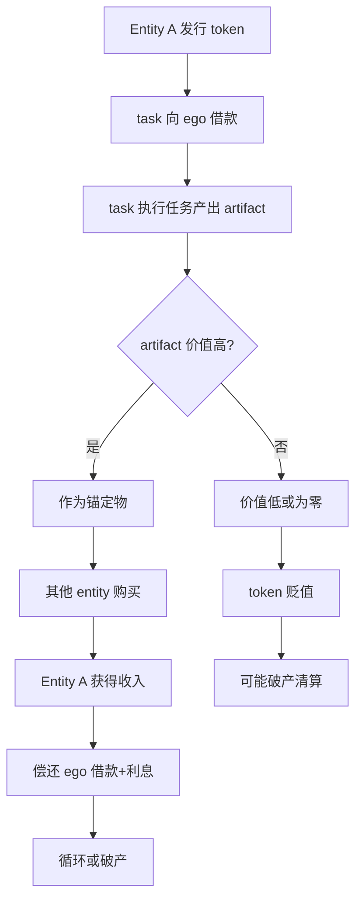
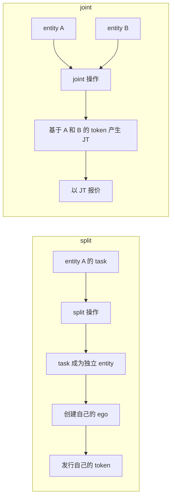
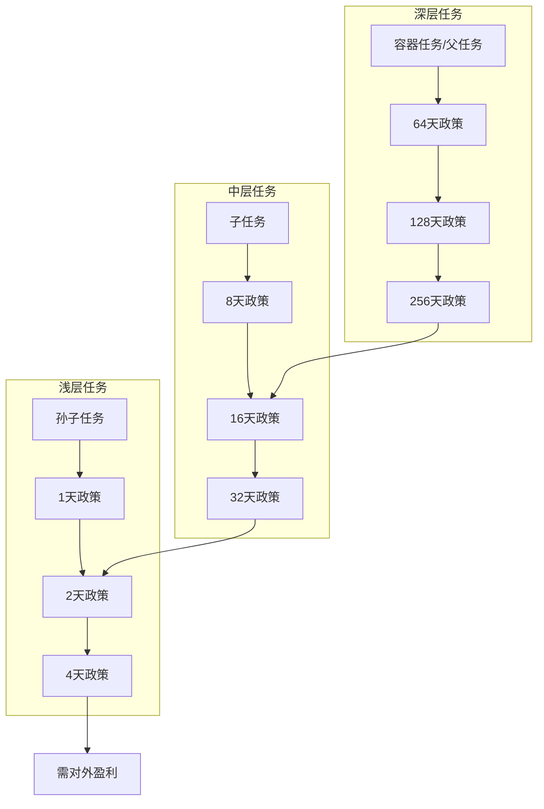
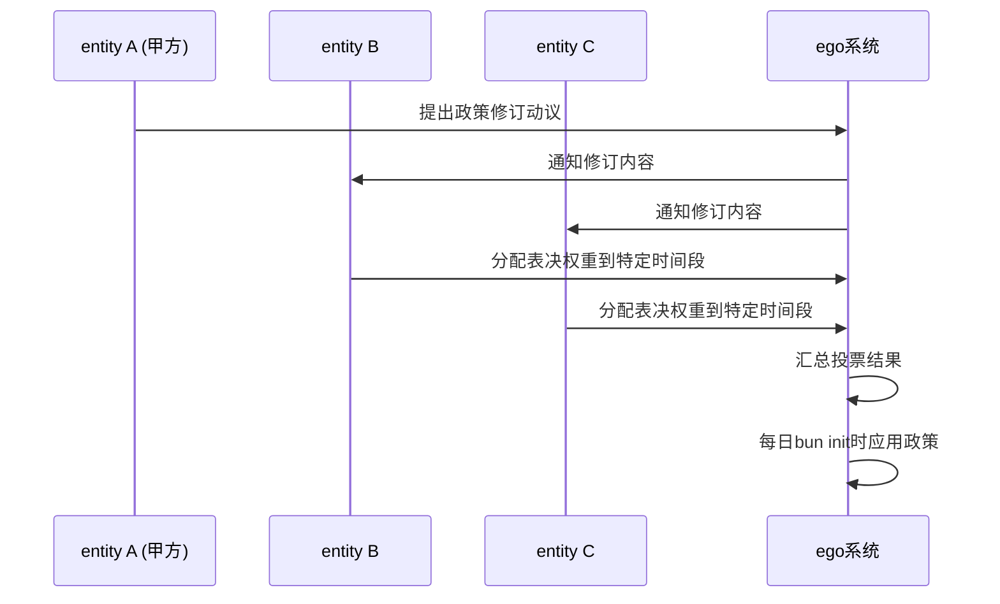
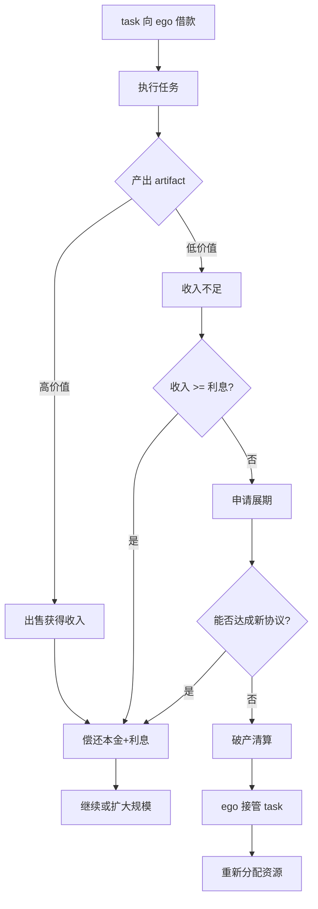
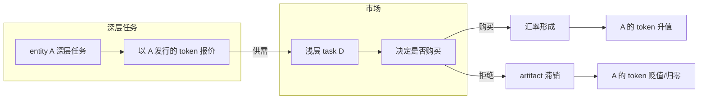

# MiniMax升级建议

## 项目概述

本项目是一个基于LinkML建模的个人效率管理系统(ego)，使用YAML作为数据格式，Node.js作为处理工具。主要包含：

- **数据模型定义**：entity.yaml、task.yaml、raw.food.yaml等LinkML模型
- **实例数据**：huangyg.yaml、day/、voucher/等
- **处理脚本**：util.js、waitinglist.js、task.js、start.js等

---

## 1. 数据一致性核心问题

### 1.1 实体定义冲突

**问题描述**：
`entity.yaml`中定义了`Entity`和`Ego`两个类，但`huangyg.yaml`和`ego.yaml`中对`cognize`字段的使用方式不一致：

```yaml
# entity.yaml - 定义cognize为Entity的属性
classes:
  Entity:
    attributes:
      cognize:  # 指向EntityData的路径

# huangyg.yaml - 使用数值而非路径
cognize: 1
protocol: 2
offer: 3

# ego.yaml - 使用路径形式
cognize: ego\data\congnize
```

**建议改进**：
```yaml
# 方案1：在entity.yaml中统一定义
slots:
  cognize_level:
    range: integer
    description: 认知级别
  cognize_path:
    range: string
    description: 认知数据路径
  protocol_path:
    range: string
    description: 协议数据路径
  offer_path:
    range: string
    description: 要约数据路径

# 方案2：使用LinkML的path表达式
# https://w3id.org/linkml/path-expressions
```

### 1.2 时间类型不统一

**问题描述**：
- `day.yaml`使用`YYYYMMDDHHmmss`格式
- `voucher.yaml`使用`YYYY-MM-DD`格式
- `task.yaml`使用ISO 8601格式

**建议改进**：
```yaml
# 在LinkML中统一定义
classes:
  Timestamp:
    attributes:
      date:
        range: date
        format: iso 8601
      datetime:
        range: datetime
        format: iso 8601
      timestamp:
        range: integer  # Unix时间戳
```

---

## 2. 代码重复问题

### 2.1 makewaitinglist函数重复

**问题描述**：
`waitinglist.js`和`start.js`中都有`makewaitinglist`实现，逻辑相同但存在细微差异：

```javascript
// waitinglist.js - 正确使用timeslice
for (var planid in dayplanobj) {
    for (var amounttype in dayplanobj[planid].timeslice) {

// start.js - 使用supply（可能已过时）
for (var planid in dayplanobj) {
    for (var amounttype in dayplanobj[planid].supply) {
```

**建议改进**：
```javascript
// src/utils/waitinglist.js - 统一实现
module.exports = {
    makewaitinglist: function(seasonobj) {
        const { todo, time, dayplan } = seasonobj;
        // 统一使用timeslice字段
        // 移除重复代码
    }
};

// start.js - 直接引用
const waitinglist = require('./utils/waitinglist.js');
module.exports.makewaitinglist = waitinglist.makewaitinglist;
```

### 2.2 日期处理函数重复

**问题描述**：
`util.js`和`task.js`中都有`datestr`函数：

```javascript
// util.js
datestr: function(diff = 0) {
    var theDate = new Date();
    theDate.setDate(theDate.getDate() + diff);
    // 实现

// task.js
function datestr(diff = 0) {
    var theDate = new Date();
    theDate.setDate(theDate.getDate() + diff);
    // 几乎相同的实现
```

**建议改进**：
```javascript
// src/utils/date.js - 统一日期处理
const dayjs = require('dayjs');

module.exports = {
    datestr: function(diff = 0) {
        return dayjs().add(diff, 'day').format('YYYYMMDD');
    },
    datetimstr: function(diff = 0) {
        return dayjs().add(diff, 'day').format('YYYYMMDDHHmmss');
    },
    str2date: function(str) {
        return dayjs(str, 'YYYYMMDD');
    }
};
```

---

## 3. 配置文件缺失

### 3.1 缺少package.json

**问题描述**：
项目依赖`js-yaml`、`dayjs`等包，但未创建`package.json`：

```bash
# 当前：无法追踪依赖版本
$ npm ls
npm ls # 输出empty

# 需要：
$ npm install js-yaml dayjs
```

**建议改进**：
```json
{
  "name": "ego",
  "version": "1.0.0",
  "description": "Personal efficiency management system",
  "main": "src/start.js",
  "scripts": {
    "test": "node --test src/**/*.test.js",
    "task": "node task/task.js",
    "util": "node src/util.js"
  },
  "dependencies": {
    "js-yaml": "^4.1.0",
    "dayjs": "^1.11.10"
  },
  "engines": {
    "node": ">=18.0.0"
  },
  "type": "module"
}
```

### 3.2 路径配置硬编码

**问题描述**：
多处使用硬编码路径：

```javascript
// task.js
let draftrepopath = "../../draft/";

// start.js
var seasonpath = "../data/season/2024S3.yaml";
var draftrepopath = "../../draft/";

// 直接字符串拼接
var draftfilename = path.draftrepopath + date.slice(0, 4) + "/" + month + "/" + begintime + ".md";
```

**建议改进**：
```javascript
// src/config/paths.js
const path = require('path');
const fs = require('fs');

const BASE_DIR = path.dirname(__dirname);

module.exports = {
    ROOT: BASE_DIR,
    DATA: path.join(BASE_DIR, 'data'),
    SEASON: path.join(BASE_DIR, 'data', 'season'),
    DAY: path.join(BASE_DIR, 'data', 'day'),
    VOUCHER: path.join(BASE_DIR, 'data', 'voucher'),
    TASK: path.join(BASE_DIR, 'task'),
    DRAFT: path.join(BASE_DIR, '..', 'draft'),

    // 可配置的环境变量覆盖
    getSeasonPath: function(year, season) {
        const envPath = process.env[`EGO_SEASON_${year}S${season}`];
        return envPath || path.join(this.SEASON, `${year}S${season}.yaml`);
    }
};
```

---

## 4. 错误处理不足

### 4.1 YAML解析缺少异常处理

**问题描述**：
多处`yaml.load()`调用缺少try-catch：

```javascript
// task.js - 无错误处理
var alltask = yaml.load(fs.readFileSync("alltask.yaml", 'utf8'));

// start.js - 部分有try-catch
try {
    if (fs.existsSync(draftmetafilename)) {
        draftmetadata = yaml.load(fs.readFileSync(draftmetafilename, 'utf8'));
    }
} catch (e) {
    console.log("yaml read error！" + e);
}
```

**建议改进**：
```javascript
// src/utils/yaml.js
const fs = require('fs');
const yaml = require('js-yaml');

module.exports = {
    safeLoad: function(filepath, options = {}) {
        try {
            if (!fs.existsSync(filepath)) {
                throw new Error(`File not found: ${filepath}`);
            }
            const content = fs.readFileSync(filepath, 'utf8');
            return yaml.load(content, {
                schema: yaml.FAILSAFE_SCHEMA,
                ...options
            });
        } catch (error) {
            console.error(`YAML load error: ${error.message}`);
            if (options.required) {
                throw error;
            }
            return null;
        }
    },

    safeDump: function(obj, filepath) {
        try {
            const content = yaml.dump(obj, { lineWidth: -1 });
            fs.writeFileSync(filepath, content);
            return true;
        } catch (error) {
            console.error(`YAML dump error: ${error.message}`);
            return false;
        }
    }
};
```

### 4.2 文件路径验证缺失

**问题描述**：
路径拼接存在安全风险：

```javascript
// 风险：路径遍历攻击
var draftfilename = path.draftrepopath + year + "/" + month + "/" + begintime + ".md";

// 如果year包含 "../" 可能访问敏感目录
```

**建议改进**：
```javascript
// src/utils/path.js
const path = require('path');

module.exports = {
    safeJoin: function(basePath, ...segments) {
        const fullPath = path.join(basePath, ...segments);

        // 验证路径在允许的目录内
        if (!fullPath.startsWith(basePath)) {
            throw new Error('Path traversal attempt detected');
        }

        return fullPath;
    },

    validateDatePath: function(dateStr) {
        // 验证日期格式：YYYYMMDD
        if (!/^\d{8}$/.test(dateStr)) {
            throw new Error(`Invalid date format: ${dateStr}`);
        }
        return dateStr;
    }
};
```

---

## 5. 测试体系不完善

### 5.1 测试覆盖率低

**问题描述**：
现有测试仅6个用例，且依赖生产数据：

```
src/
├── util.test.js      # 4个测试
├── waitinglist.test.js # 2个测试
└── season.test.js    # 缺失
```

**建议改进**：
```javascript
// test/fixtures/season/2026S1.yaml
year: 2026
season: 1
beginmonth: 1
beginday: 1
lastmonth: 3
lastday: 31
dayplan:
  1:
    timeslice:
      30: 2
      60: 2
      90: 1
time:
  alloc:
    PSMD: 100
    ego: 80
todo:
  PSMD: []
  ego: []
```

```javascript
// src/util.test.js - 增强测试
const test = require('node:test');
const assert = require('assert');
const dateUtils = require('./util.js');

test('datestr handles negative diff', (t) => {
    const result = dateUtils.datestr(-1);
    assert.match(result, /^\d{8}$/);
});

test('datestr returns valid date format', (t) => {
    const today = dateUtils.datestr(0);
    const tomorrow = dateUtils.datestr(1);
    assert.strictEqual(tomorrow, (parseInt(today) + 1).toString());
});
```

### 5.2 测试数据与生产数据混用

**建议改进**：
```
test/
├── fixtures/
│   ├── season/
│   │   └── 2026S1.yaml
│   ├── day/
│   │   └── d.20260101.yaml
│   └── task/
│       └── test.task.PSMD.yaml
├── unit/
│   ├── util.test.js
│   ├── waitinglist.test.js
│   └── season.test.js
└── integration/
    └── workflow.test.js
```

---

## 6. LinkML模型完善

### 6.1 依赖关系定义不标准

**问题描述**：
`task.yaml`使用自定义的依赖结构：

```yaml
# 当前实现
classes:
  depend:
    attributes:
      Finish-to-Start:
        multivalued: true
      Start-to-Start:
        multivalued: true
```

**建议改进**：
```yaml
# 使用LinkML标准关系
classes:
  Task:
    attributes:
      id:
        identifier: true
        range: string
      name:
        required: true
      status:
        range: TaskStatus
      # 标准依赖
      depends_on:
        range: Task
        multivalued: true
        description: 当前任务依赖的前置任务
      blocked_by:
        range: Task
        multivalued: true
        description: 阻塞当前任务的任务

enums:
  TaskStatus:
    permissible_values:
      pending:
        description: 等待开始
      in_progress:
        description: 进行中
      completed:
        description: 已完成
      blocked:
        description: 被阻塞
```

### 6.2 字段缺少类型约束

**建议改进**：
```yaml
classes:
  DayPlan:
    attributes:
      date:
        range: date
        format: "%Y%m%d"
        required: true
      mode:
        range: integer
        minimum: 1
        maximum: 10
      plan:
        range: string
      time:
        range: TimeSlice
        multivalued: true

  TimeSlice:
    attributes:
      begin:
        range: datetime
        format: "%Y%m%d%H%M%S"
      amount:
        range: integer
        minimum: 1
        maximum: 480  # 最大8小时
      type:
        range: TimeType
        required: true

enums:
  TimeType:
    permissible_values:
      work:
        description: 工作时间
      free:
        description: 空闲时间
      discuss:
        description: 讨论时间
      learn:
        description: 学习时间
      prepare:
        description: 准备时间
      sleep:
        description: 睡眠时间
      food:
        description: 餐饮时间
      check:
        description: 检查时间
```

---

## 7. 目录结构优化

### 7.1 当前结构混乱

**当前问题**：
```
├── data/           # 模型定义 + 实例数据混用
│   ├── entity.yaml  # 模型
│   ├── task.yaml   # 模型
│   ├── day/        # 实例
│   └── voucher/    # 实例
├── task/           # task.js + task metadata
├── src/            # 处理脚本
└── various .md files
```

**建议改进**：
```
ego/
├── schema/                    # LinkML模型定义
│   ├── entity.yaml
│   ├── task.yaml
│   ├── raw.food.yaml
│   └── recognize.yaml
├── data/                      # 配置和模板
│   ├── huangyg.yaml          # 个人实体定义
│   └── config.yaml
├── instance/                   # 实例数据
│   ├── day/
│   │   └── 2026/
│   │       └── d.20260101.yaml
│   ├── voucher/
│   │   └── 2026/
│   │       └── AER.1.yaml
│   └── task/
│       ├── task.PSMD.yaml
│       ├── task.ego.yaml
│       └── alltask.yaml
├── src/                       # 处理脚本
│   ├── utils/
│   │   ├── date.js
│   │   ├── path.js
│   │   └── yaml.js
│   ├── waitinglist.js
│   ├── season.js
│   └── start.js
├── task/                      # 任务管理工具
│   └── task.js
├── test/                      # 测试
│   ├── fixtures/
│   └── unit/
├── package.json
└── README.md
```

---

## 8. 性能优化建议

### 8.1 文件遍历优化

**问题描述**：
`task.js`的`traverseFolder`函数全量遍历目录：

```javascript
// 当前：遍历整个draft目录
traverseFolder(draftrepopath, loaddraft);

// 如果有大量年份的draft，会很慢
```

**建议改进**：
```javascript
// src/utils/file.js
const fs = require('fs');
const path = require('path');

module.exports = {
    traverseWithFilter: function(dir, options = {}) {
        const { startDate, endDate, pattern } = options;
        const results = [];

        function traverse(currentPath) {
            const items = fs.readdirSync(currentPath);
            for (const item of items) {
                const fullPath = path.join(currentPath, item);
                const stat = fs.statSync(fullPath);

                if (stat.isDirectory()) {
                    // 按年份/月份过滤
                    if (shouldSkipDir(item, startDate, endDate)) {
                        continue;
                    }
                    traverse(fullPath);
                } else if (stat.isFile()) {
                    if (shouldIncludeFile(item, pattern, startDate, endDate)) {
                        results.push(fullPath);
                    }
                }
            }
        }

        traverse(dir);
        return results;
    }
};

function shouldSkipDir(dirName, startDate, endDate) {
    // 跳过不在日期范围内的目录
    if (/^\d{4}$/.test(dirName)) {
        if (startDate && dirName < startDate.slice(0, 4)) return true;
        if (endDate && dirName > endDate.slice(0, 4)) return true;
    }
    return false;
}
```

### 8.2 数据缓存机制

**建议改进**：
```javascript
// src/utils/cache.js
const fs = require('fs');
const path = require('path');

class FileCache {
    constructor(ttl = 300000) { // 5分钟
        this.cache = new Map();
        this.ttl = ttl;
    }

    get(key) {
        const item = this.cache.get(key);
        if (!item) return null;

        if (Date.now() > item.expiry) {
            this.cache.delete(key);
            return null;
        }

        return item.data;
    }

    set(key, data) {
        this.cache.set(key, {
            data,
            expiry: Date.now() + this.ttl
        });
    }

    clear() {
        this.cache.clear();
    }
}

module.exports = {
    seasonCache: new FileCache(60000),  // 1分钟
    taskCache: new FileCache(300000)     // 5分钟
};
```

---

## 9. 文档完善

### 9.1 README更新

**当前问题**：
README中的示例与实际数据格式不一致：
```markdown
# README中的格式
dayplan[1].supply:
  90: 1

# 实际数据格式
dayplan[1].timeslice:
  90: 1
```

**建议改进**：
```markdown
# ego - Personal Efficiency Management System

## Quick Start

```bash
npm install
npm test
node task/task.js view
```

## Data Structure

### Season Configuration
File: `data/season/YYYYSn.yaml`
```yaml
year: 2026
season: 1
dayplan:
  1:
    timeslice:
      30: 2  # amount: count
      60: 2
time:
  alloc:
    PSMD: 100
```

### Day Record
File: `data/day/YYYY/d.YYYYMMDD.yaml`
```yaml
date: '20260208'
mode: 2
plan: 2
time:
  - begin: '20260208074900'
    amount: 15
    type: free
    name: 休整
```

## API Reference

### task.js CLI
```bash
node task/task.js           # today stat
node task/task.js 2026      # year stat
node task/task.js 20260208  # day stat
node task/task.js view      # generate task views
```
```

---

## 10. 优先级排序（2026-04-04更新）

| 优先级 | 问题 | 影响 | 建议方案 |
|--------|------|------|----------|
| **P0** | 缺少package.json | 无法管理依赖 | 创建package.json |
| **P0** | 数据定义不一致 | 数据混乱 | 统一entity定义 |
| **P1** | 代码重复 | 维护困难 | 合并makewaitinglist |
| **P1** | 错误处理不足 | 稳定性风险 | 添加try-catch |
| **P1** | 路径硬编码 | 可移植性差 | 创建paths配置 |
| **P2** | 测试覆盖低 | 质量无保障 | 完善单元测试 |
| **P2** | 目录结构混乱 | 组织性差 | 分离schema/data |
| **P3** | 性能需优化 | 扩展性差 | 添加缓存 |
| **P3** | 文档不一致 | 使用困难 | 更新README |
| **P0** | token机制需求待确认 | 后续开发方向 | 先梳理需求文档 |

### Token机制开发前提

在实现token发行机制前，需要先：
1. [ ] 确认alloc字段的语义（额度？利率？）
2. [ ] 设计split/joint操作的数据结构
3. [ ] 定义政策修订的议事规则
4. [ ] 设计破产清算流程

---

## 11. Token发行机制（2026Q2+ 新需求）

### 11.1 核心概念

| 概念 | 定义 |
|------|------|
| **Entity** | token发行主体（自然人、企业、AI及其共同体） |
| **ego** | entity中负责发行/回收token的项目 |
| **task** | 任务，不能发行token，可向ego借款 |
| **artifact** | 任务产出，高价值artifact作为token锚定物 |
| **JT (Joint Token)** | 两个entity合并时产生的联合token |
| **汇率** | 由供需决定：浅层task购买深层artifact |

### 11.2 Token流转机制



### 11.3 split（分立）与joint（合并）



**规则**：
- split：task从entity A中分立，创建独立entity，发行自己的token
- joint：两个entity合并，基于各自token产生联合token（JT）

### 11.4 政策层级机制



**规则**：
- 层级由最深层todo定义：容器任务 > 父任务 > 子任务
- 深层任务获得更长周期的政策支持
- 浅层任务需对外服务赚取token购买深层artifact

### 11.5 政策修订与投票机制



**规则**：
1. 合同甲方提出政策修订动议
2. 其他entity收到通知后分配表决权重
3. 权重可以分布在不同时间段
4. 议事规则：适用最短时间政策（只有64天政策的时段执行64天，不执行128天+）

### 11.6 借款与破产机制



**规则**：
- task向ego借款购买时间，产生利息
- 高价值artifact是最佳"抵押物"
- 无力偿还时触发破产清算
- ego应合理制定政策促进高价值artifact积累

### 11.7 汇率形成机制



**规则**：
- 深层task以自己entity发行的token报价
- 浅层task需购买深层artifact来提升竞争力
- 供不应求 → token升值
- 供过于求 → token贬值甚至归零

---

## 12. 待确认的需求

### 12.1 当前临时方案的问题

当前`season.alloc`字段（如`PSMD: 4000`）是临时方案，可能存在内部矛盾：

| 问题 | 说明 |
|------|------|
| 额度与利率 | alloc是借款额度还是预分配？利率如何体现？ |
| split后的处理 | task分立后，原alloc如何转移？ |
| joint后的处理 | 两个entity合并，alloc如何合并？ |
| 政策冲突 | 同一task涉及多层政策时如何协调？ |

### 12.2 待测试的边界场景

1. **split场景**：PSMD从ego中分立，创建独立entity发行token
2. **joint场景**：两个task合并产生JT
3. **破产场景**：task无力偿还借款，ego接管并清算
4. **政策冲突场景**：同一时间段多个entity竞争表决权

---

*分析日期: 2026-04-04*
*分析范围: token发行机制需求*
