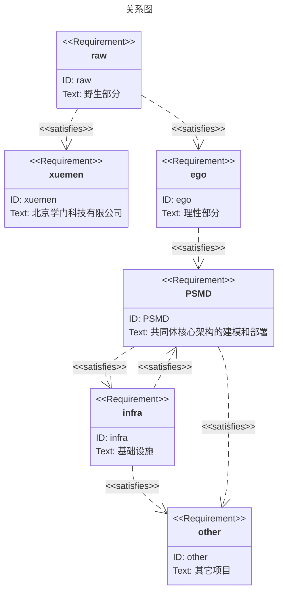

# the code of huangyg

## 个人领域模型

ego是[通用个人领域模型](common.com.md)、[俱乐部](club.com.md)的分支版本，它最终会以软件形式发布。  

* [通用模型](common.com.md)
* [俱乐部](club.com.md)
* [ego设计方案](ego.com.md)
* [ego部署方案](cod.md)

具体概念可以参考[设计笔记](README.note.md)。

## git库

- raw：无意识的部分
    - log
        - food
        - health
    - data
    - src
        - raw.js
    - view
        - 各级时间段food、health的报表
- ego：有意识的部分
    - log
        - 各级时间段的计划小结metadata
    - data
        - 时间模版的metadata
        - contract的metadata
        - task的metadata
        - 内部账目的metadata
        - 各独立项目的metadata
    - src
        - time.js
        - task.js
    - view
        - 各级计划小结的markdown、html文件
        - contract、task、内部账目的报表
- blog：个人正规发布。可能根据各git托管网站的page格式重整：
    - 和用户名同名
    - 和个人域名同名
- draft：内部手稿，防止硬盘问题备份到私有库。
- x.sample: 练习范例
- com.origin: 共同体模型的雏形
- cod.template: 共同体部署方案的模版
- 独立个人项目，如PSMD
    - log
    - data
        - term、termset、error、knowledge的metadata
    - src
        - term.js
    - view

- ego
    - thing.yaml
    - entity.yaml
    - ego.yaml
    - data
        - event
        - promise
        - error
            - error.*.yaml
        - raw
        - offer
            - term.spilit.yaml
            - term.joint.yaml
            - term.default.yaml
        - protocol
            - term.ego.yaml
        - vat
    - src
    - view
        - ego.md
        - ego.html
        - raw.md
        - raw.html
        - 
- raw
- 
    

## 基本概念
以下是entity在外部记录中使用的概念

- 物体|thing: 与知识图谱的thing定义相同。(https://schema.org.cn/Thing)
- 主体|entity: 具有认知(cognize)行为的物体(thing)。
    - event: 与知识图谱的event定义相同。（https://schema.org.cn/Event） 
    - promise：承诺的行为。
        - event的所有字段。
        - effect：行为的后果，一组event。
    - raw: entuity还没有认知的自身行为的集合。
    - 知识|knowledge: 对推理的描述，包括描述行为的后果。
- ego: 通过创造vat、在vat中设立主体(entity)来认知的entity。
    - error
    - offer
    - protocol
       - spilit
       - joint
    - vat: 支持entity的思想和行为的知识（定义、概念、假设等等）的thing。
- 认知|cognize: 认知是描述认知对象的行为。认知对象可以是thing和entity，包括自身。
- 行为：
    - 包括推理
    - 包括自身的行为
- 协议|protocol: 多个entity的共同认知。
    - 对thing的所有权是entity行为的一种认知。
    - 要约|offer: 是一个entity单方面认可的protocol。发布要约是一种行为，因此表示知识进入实践。
- 元认知|meta: 认知推理和行为所使用的知识（概念、定义、假设等等）。
- 容器|vat: 为entity的推理和行为提供知识的protocol。
    - 以protocol替换原有知识；
    - 先有明确的知识，再有使用这些知识的推理和行为；
    - 通过替换知识来改变推理和行为。
- 分立|spilit: 一个entity产生多个entity的行为。
- 联合|joint: 多个entity产生一个entity的行为。
- 共同体|community：由多个主体joint合并而成的主体。

## 接口

- 门户页：写在个人域名dns，各种软件或纸质的个人简介、签名档。内容根据当时需要统筹规划。
- blog
- raw\view
- ego\view
- ego\contract
    - 要约的浏览、签署
        - gathering
        - PSMD委托
    - 要约的自动组合、对签

版权声明：

1. 本库作品版权归[黄勇刚](mailto:huangyg@mars22.com)所有。
2. 除非作品内特别声明，本库作品采用[署名-非商业性使用-相同方式共享 4.0 国际 (CC BY-NC-SA 4.0)](http://creativecommons.org/licenses/by-nc-sa/4.0/)进行许可。  
