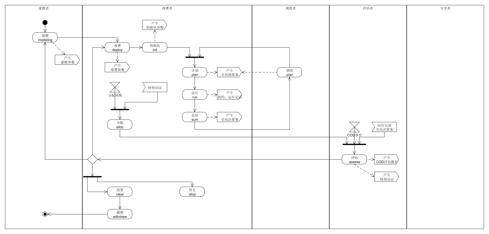

###the code of huangyg.

##COM设计 

###角色清单
1. 建模者（modeler）
2. 部署者（deployer）
3. 调度者（allocator）
4. 评估者（assessor）
5. 分享者（sharer）

###资产清单
1. 资金
	1. 人民币
2. 其它资产
	1. cod股权（仅限股份制cod） 
	2. cod提货权
	3. 固定资产
3. 时间
4. 信息资产
	1. COM模型
	2. COM许可证
	2. COM建模参数
	3. COD部署方案
	4. COD部署参数
	5. 初始化参数
	6. 成员名录
	7. 成就点记录
	6. COD评估报告
	7. 全局预算案
	8. 运行记录
	9. 全局决算案
	10. 立项申请
	11. 立项审议意见
	1. 契约
	2. 特别动议

###任务清单
1. 建模：设计
	1. 输入：无（在本模型以外观察总结）
	2. 输出：
		- COM模型
		- COM许可证
		- COM建模参数
2. 建模：升级
	1. 输入：
		- COD评估结果
	2. 输出：
		- COM模型
		- COM许可证
		- COM建模参数
3. 部署
	1. 输入：
		- COM模型
		- COM许可证
		- COM建模参数
	2. 输出：
		- COD部署方案
		- COD部署参数

4. 初始化
	1. 输入：
		- COM模型
		- COM建模参数
		- COD部署方案
		- COD部署参数
	2. 输出：
		- 成员名录
		- 初始化参数
5. 运行
	1. 输入：
		- COM模型
		- COM建模参数
		- COD部署方案
		- COD部署参数
		- 成员名录
		- 初始化参数
	2. 输出：
		- 成员名录
		- 全局预算案
		- 运行记录
		- 全局决算案 
6. 分配
	1. 输入：
		- COM模型
		- COM建模参数
		- COD部署方案
		- COD部署参数
		- 成员名录
		- 初始化参数
		- 运行记录
	2. 输出：
		- 成就点记录
7. 评估
	1. 输入：
		- COM模型
		- COM建模参数
		- COD部署方案
		- COD部署参数
		- 成员名录
		- 初始化参数
		- 全局预算案
		- 运行记录
		- 全局决算案 
		- 成就点记录
	2. 输出：
		- COD评估报告
7. 清算和撤销
	1. 输入：
		- COD评估报告
	2. 输出：
		- 成就点记录
2. cod评估
3. 资源结算 
4. 资源分配

###协作过程

1. 建模
	1. 建模者设计并发布本模型。
	2. 建模者应公布根据本模型部署的各ego系统。
	3. 建模者根据各部署运行情况升级模型。

2. 部署
	1. 任何人需要使用ego管理自己的资源，都可以根据模型部署ego系统。
	2. 部署工作包括：
		1. 制定向建模者分配成就点的规则，以及反馈运行情况的方式。
		2. 制定用户角色申请、登记、变更通知、查阅的方式。
		3. 制定评估者查阅各层次cod的方式。
		4. 决定信息资产的提交、调阅方式。
		5. 确定各类资产与成就点的换算公式。
		6. 明确资金和其它资产的具体提取手续。
		7. 以上（部分）工作如使用人工，应公布联系方式。
		8. 以上（部分）工作如使用软件，部署软件并公布访问接口。
 
3. 获得角色
	0. 设计并发布本模型者成为建模者modeler。
	1. 根据模型部署ego并托管自己资源的成为部署者deployer。
	2. 任何新用户可以成为评估者assessor。
	3. 评估成就排在年度首位的评估者，可以申请成为调度者allocator，经部署者同意后生效。
	4. 在某层次符合以下标准之一者，任何一方可以提议绑定为分享者sharer：
		1. 当部署者在该层次出现赤字时，曾经接受提议者提供的无偿资助。资助额超过提议者资产的20%，且资助至提议时间超过五年。
		2. 连续三年 A/A1 >= 50% 且 A/A2 >= 50% ，其中A是提议者与部署者在该层次的共同成就，A1、A2分别是部署者和提议者在该层次的成就。  
	以上提及的资产、成就均按照本ego的换算公式计算。提议经另一方同意后生效。
	5. ego公开各用户的角色，任何人可以匿名查阅。

4. 角色的失去、终止、暂停和恢复
	1. 连续十二个月没有取得评估成就者，失去评估者角色。
	2. 连续二十四个月没有提交《全局预算案》建议稿的，失去调度者角色。
	3. 调用分享特权的、不响应分享特权的，失去分享者角色。
	4. 评估者可以暂停和恢复，暂停期间按十分之一计算连续时间。
	5. 调度者角色可以终止。
	6. 失去评估者角色、失去调度者角色、因不响应分享特权而失去分享者角色的，成就点清零且不能再新增任何角色。

5. cod评估
	1. 评估者可以提交《cod评估报告》，指出该cod不符合对应com的情形。
	2. 评估者获取信息、编写《cod评估报告》、提交给ego的过程，应符合法律法规以及目标cod的规章。

6. 资源结算：部署者可以提交《全局决算案》，公布各层次专户的收支和结余。

7. 资源分配：
	1. 调度者应分析每一份《全局决算案》，编写或修订《全局预算案》，明确未来的资产分配。
	2. 部署者应汇总各调度者的《全局预算案》建议稿，提交正式稿。
	3. ego按照《全局预算案》正式稿运行。

###分配过程
1. 成就：
	1. “成就点”是ego内部记账单位，精确到小数点后两位。
	2. 部署者应制定提交各项资产与成就点的换算公式。
	3. 成就点不可继承，不可转让。 

2. 共同成就：
	1. 多人组成cod，并且符合以下条件：
		* 任何一人在所有契约中均可全权代表该cod。
		* 任何一人无须其他人许可即可把cod所有资产转为个人所有。  
		这个cod的人均资产可以记作共同成就。
	2. 按某个cod的内部记账方式，两人的贡献值一直排在前两位。这两人从这个cod中获得的成就视为共同成就。

3. 专户
	1. 每个层次设立一个专户。
	2. 每个专户可以登记所有种类的资产，以及按照换算公式折算的成就点。

4. 通用回报
	1. 如果所有层次所有种类资产均没有赤字，各成就点持有者可以申请兑换结余资产。
	2. 经部署者同意后，即可按换算公式办理资产转让手续。
 
5. 评估者回报
	1. 根据各层次的时间消耗情况，部署者拨出部分时间作为评估者的回报。
	2. 评估者可以扣减部分成就点换取时间回报。
	3. 在回报时间内，扣减成就点最多的五人可提交问题，其他评估者旁听。如果问题与回报时间所属层次相符，部署者应围绕问题与大家讨论。

6. 调度者回报
	1. 根据第零层时间消耗情况，部署者从中拨出部分时间作为调度者的回报。
	2. 在回报时间内，部署者阅读调度者的《全局决算案》或同类资料，为其编写《全局预算案》建议稿。
	3. 如果时间不足，部署者根据各调度者的《全局预算案》建议稿内容质量决定优先级。

7. 分享者回报
	1. 当部署者或分享者在绑定层次出现赤字时，可以行使分享特权。
	2. 其他方应调用所绑定层次专户结余的30%以上，用于协助行使特权的一方。